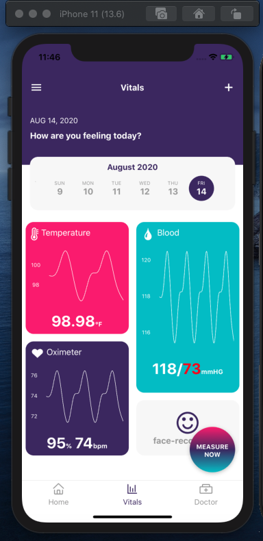
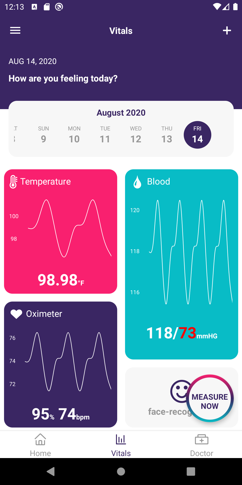
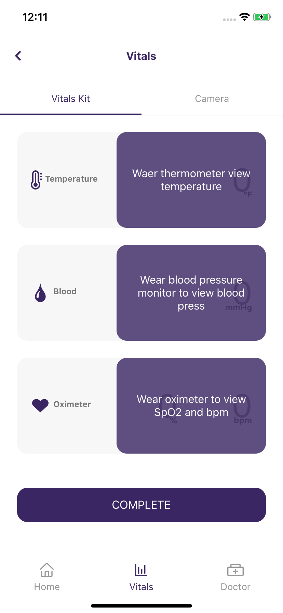
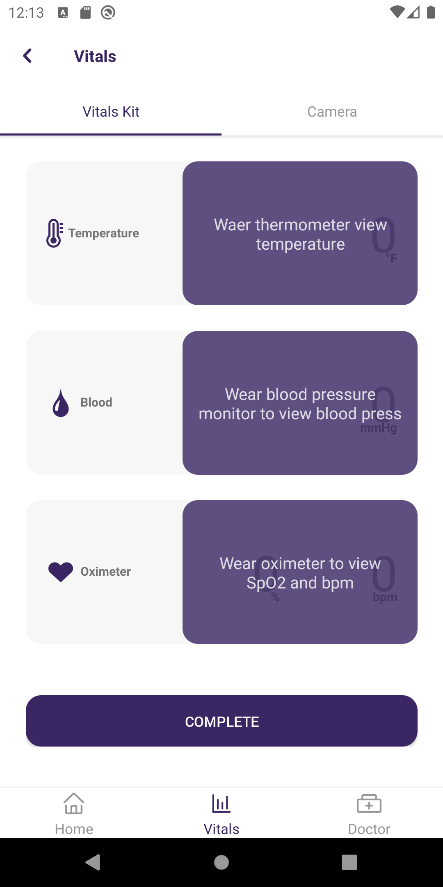
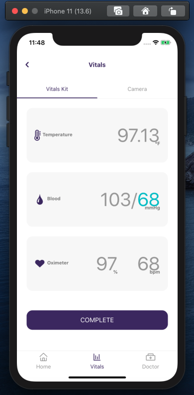
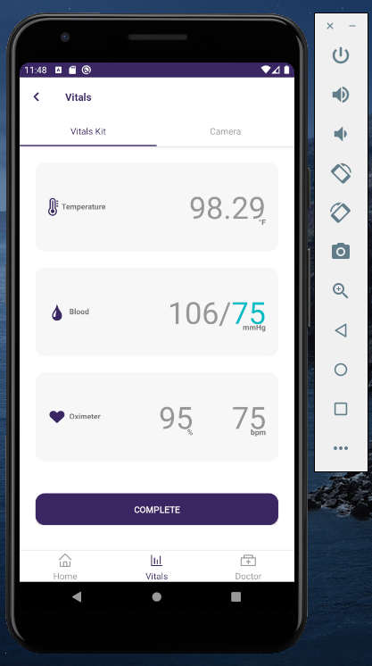
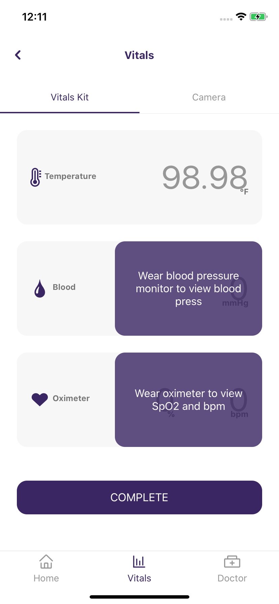
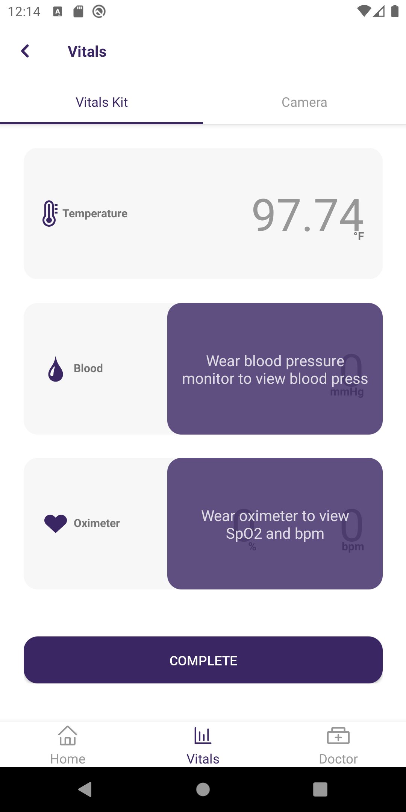
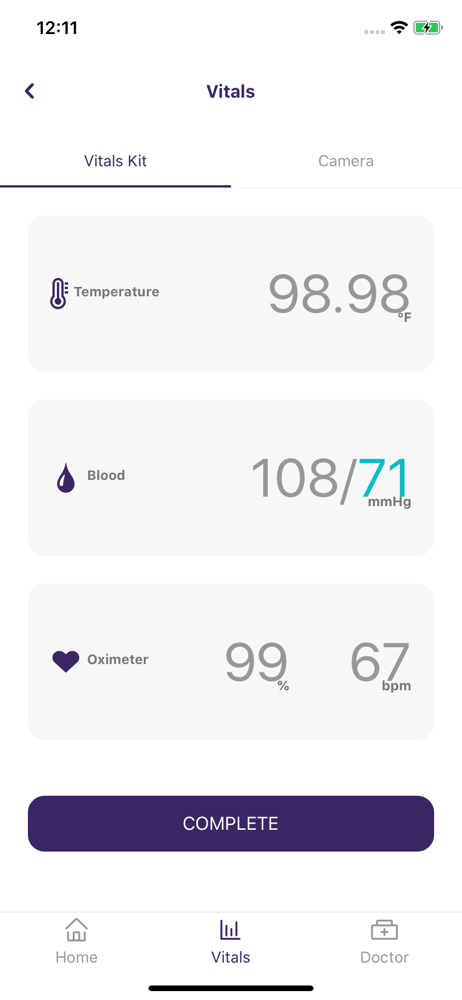
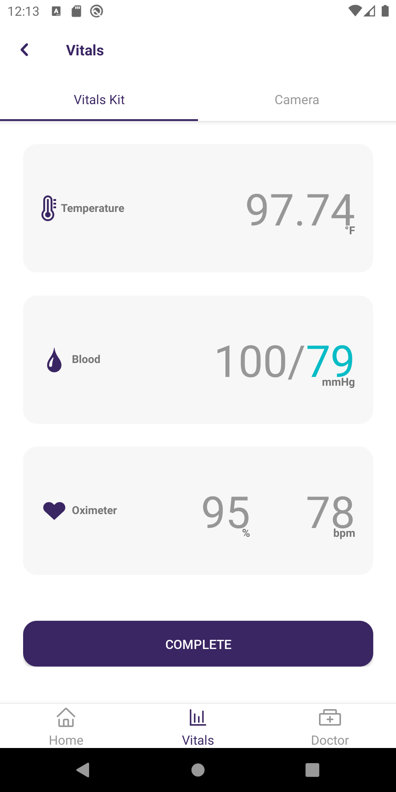

# Vitals app - *React Native*

Drawer, Stacks and tabs navigators implemented in a simple 2 screen. Using **React navigator 5**, **React Native 0.63**, **Redux** and **Redux Thunk**

### Backend integration ###
This develop has integration with [this](https://github.com/jacuna565/basic-nodejs-api-rest) ApiRest (already linked in the app)

|    iPhone     |    Android    |
| ------------- | ------------- |
|   |   |
|   |   |
|   |  |
|   |  |
|   |  |

##### *Note* #####
Make sure to do your inital configurations on Android Studio or Xcode in order to run this well.

### Installing ###
```
$ git clone https://github.com/YOUR-USERNAME/vitals-app.git
$ git cd vitals-app.git
$ git npm install
```

### Running ###
Run server:
``
$ npx react-native start
``

Android:
``
$ npx react-native run-android
``

iOS:
``
$ npx react-native run-ios
``

:)

